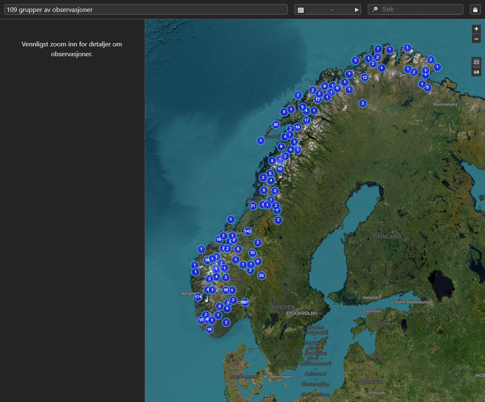

# Norwegian UFO Database

* npm Typescript Monorepo
* Koa
* React (hooks)
* Redux Toolkit 
* Jest
* Vite 
* OpenLayers 9
* PostGIS
* UFOs

## Synopsis

```bash
  # After installing the DB and editing the config:
  npm install

  # For dev, either
  npm run dev:api &
  npm run dev:client
  # or to do both via 'concurrently':
  npm start

  # For production
  npm run build -ws
```

## Description

* Server-side clustering
* Text search
* Date-range search
* CSV downloads

This [Vite](https://vitejs.dev/)-bundled Typescript React app uses [Redux Toolkit](https://redux-toolkit.js.org/) to drive the state-based display and search of an [OpenLayers](https://openlayers.org/) map served by [PostGIS](http://postgis.net/documentation/getting_started/install_windows/).

Data is fectched for whatever region is visible, and filtered by search terms entered at the top of the window. 
If zoomed out by a configurable amount, the server clusters the points that represent sightings.

## Feedback, pull requests

Please fix anything you can or suggest a better way of doing things.

## Limitations

* Much of the Norge UFO data is yet to be processed. Any advice on reading the schema much appreciated.
* The map's minimum zoom level is set to avoid over-taxing the server and the client: hopefully will find time to produce density maps for such zoom levels.
* The heatmap may be slow, so perhaps write a custom loader to load a CSV

## User Journey

Sightings are clustered when zoomed out:



When the map is zoomed in or searched, sightings are displayed on the map and in an abbreviated table:


Selecting a point highlights it:


Clicking the arrow in the head of the abbreviated table opens the full table:


Both tables give access to the details of the full report:


At any time, the visible sightings can be downloaded as a CSV:


When viewing points, clicking the date range calendar icon  shows a histogram of the sightings by year:


## Technical

All state is controlled by the Redux 'slices':

- `gui`: the state of the interface
- `details`: the details of a single report
- `map`: everything needed to query and render results.

The service layer is provided by Koa for simplicity, but could use any Express-type framework that can import routes/middleware.

### Installing and Accessing the DB

There is a dump of the current state of the PostGIS database: [./data/norge/pg-dump/](./data/norge/pg-dump/) - install the usual way with `psql < dump.sh`.

Configuration access options in hard-coded  in [the global config](./packages/config/): PG access tries the usual PG environment varirables, but of course this should (and will) be upgraded to use `.env` files.

Soem work has been done to port to MySQL, but the big `update.sql` has yet to be tackled.

Location data is stored in EPSG:3857 for speed, with the API accepting EPSG:4326/WGS84 for legibility.

## The Current State of the data

### UFO Norge

Locations of sightings were semi-manually geocoded from the locations given in the original MS Access database, which was converted to both Postgres and MySQL by a trial version of [Exportizer Enterprise](https://www.vlsoftware.net/exportizer/). The [data/norge/](data/norge/) directory contains those dumps, as well as scripts used to restore relations between the tables, convert the column names to English (since we hope to add Swedish and other data too), as well as cleaning dates and some other values.

Some effort has been put into massaging dates into usable state (`197?-13-31` was no use), as well as to geocode the sighting locations to gain latitude and longitude to plot.

As far as I can tell today, table relations (missing in the MDB dump) have been restored.

However, there are still lots of entries such as:

    Hvor befant de dem(4,1,1)	  false
    Hvor befant de dem(4,1,2)	  false

I've had to rename these as part of the move to MYSQL. Perhaps they relate to the `hovedtabell querybaerum` table?

### MUFON

Some kind soul has done most of the above for the [MUFON dataset](data\mufon\datapackage.info.json) avaiable through Kaggle.

See [./data/mufon/](./data/mufon/) for the ingestion script. The data is not as verbose, but does cover quite a large area. The text had some HTML entities good and bad (soem of tabs and commas, presumably from others' ingestion), which are tidied by the SQL ingestion scripts.

## Todo:

* Sort order toggling (2h) - atm sorting is by score if the is one, otherwise by date, but dates need work
* Tighten linting.
* Tests.
* Logger transports/etc
* Store bounds and filter settings in the URI? (4h)
* Initialise with map extent rather than center
