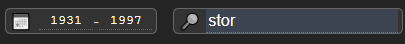

# Norwegian UFO Database

Work in progress.

* npm Monorepo
* Typescript 
* Koa
* React (hooks)
* Redux Toolkit 
* Jest
* Vite 
* OpenLayers 9
* PostGIS
* UFOs

## Synopsis

```bash
  # After installing the DB and editing the config:
  npm install

  # Either
  npm run dev:api &
  npm run dev:client

  # Or to do both via 'concurrently':
  npm start
```

## Description

A simple OpenLayers map to fetch and display data when the map is rendered, zoomed, or moved, with a portable Koa data access layer to a supplied PostGIS database.

* Clustering
* Text search
* Date-range search
* CSV downloads

Data is fectched for whatever region is visible, and filtered by search terms entered at the top of the window. If zoomed out
by a configurable amount, the server clusters the points.

Everything is controlled by the Redux 'slices':

- `gui` contains stuff just relating to the interface
- `details` just the details of a single report
- `map` contains everything needed to query and render results.

## Installing and Accessing the DB

Currently porting to also run on MySQL.

There is a PostGIS database dump in [./data/norge/pg-dump/](./data/norge/pg-dump/): install the usual way with `psql`.

Configuration access options in hard-coded  in [the global config](./packages/config/): PG access tries the usual PG environment varirables, but of course this should (and will) be upgraded to use `.env` files.

The database was constructed from an MS Access dump, which can be found in [./data/norge/](./data/norge/) along with the scripts used to port it to PostGIS. The only manual step remaining is geocoding, which was done via a free of charge online geocoder and exported as CSV.

## State of the data

Some effort has been put into massaging dates into usable state (`197?-13-31` was no use), as well as to geocode the sighting locations to gain latitude and longitude to plot.

As far as I can tell today, table relations (missing in the MDB dump) have been restored.

However, there are still lots of entries such as:

    Hvor befant de dem(4,1,1)	  false
    Hvor befant de dem(4,1,2)	  false

I suspect these rely upon entries in `Switchboard Items`, at which I have yet to look.

## Feedback, pull requests

Please fix anything you can or suggest a better way of doing things.

## Todo:

* Sort order toggling (2h) - atm sorting is by score if the is one, otherwise by date, but dates need work
* Fix all dates
* Add to dateitme `Obs  startet kl (32)` (eg `19.45`)
* Link to full details
* Tests.
* Logger transports/etc
* Store bounds and filter settings in the URI (4h)
* Highlight on map feature chosen in report or click on
* Initialise with map extent rather than center
* Server should infer cluster size (`cluster_eps`) from zoom level.
* Expose more data: 
  * shape, colour, direction, etc from lin columns
  * Include `Hvor lenge iakttok?(35)`

## DB

Using PostGIS, storing data in EPSG:3857 for speed, with the API accepting EPSG:4326/WGS84 for legibility.

## Pics

Points are clustered when zoomed out:


One can toggle between three different base maps:


Zoom in to clusters to view individual sightings, with a list of their reported dates and locations:


Search the visible area of the map for text that appears in the report (location, report text, more later):


After making a search query, points are displayed.

Whenever points are displayed, the date range input is populated with the minimum and maximum values of the visible points:



The table on the left links to the full report, which will in time link to all the available data:


Clicking the date range when viewing points shows a histogram:


.

.

.

.

.

.

## Biolerplate Notices

This template provides a minimal setup to get React working in Vite with HMR and some ESLint rules.

Currently, two official plugins are available:

- [@vitejs/plugin-react](https://github.com/vitejs/vite-plugin-react/blob/main/packages/plugin-react/README.md) uses [Babel](https://babeljs.io/) for Fast Refresh
- [@vitejs/plugin-react-swc](https://github.com/vitejs/vite-plugin-react-swc) uses [SWC](https://swc.rs/) for Fast Refresh

## Expanding the ESLint configuration

If you are developing a production application, we recommend updating the configuration to enable type aware lint rules:

- Configure the top-level `parserOptions` property like this:

```js
export default {
  // other rules...
  parserOptions: {
    ecmaVersion: 'latest',
    sourceType: 'module',
    project: ['./tsconfig.json', './tsconfig.node.json'],
    tsconfigRootDir: __dirname,
  },
}
```

- Replace `plugin:@typescript-eslint/recommended` to `plugin:@typescript-eslint/recommended-type-checked` or `plugin:@typescript-eslint/strict-type-checked`
- Optionally add `plugin:@typescript-eslint/stylistic-type-checked`
- Install [eslint-plugin-react](https://github.com/jsx-eslint/eslint-plugin-react) and add `plugin:react/recommended` & `plugin:react/jsx-runtime` to the `extends` list
